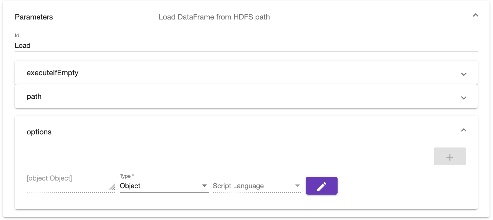
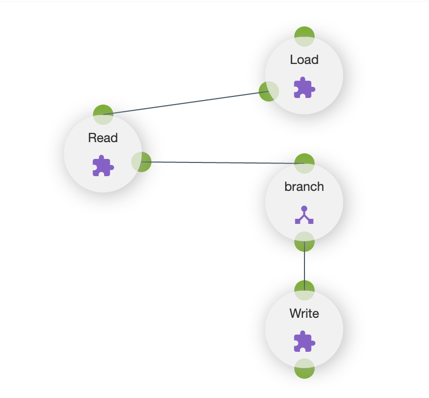
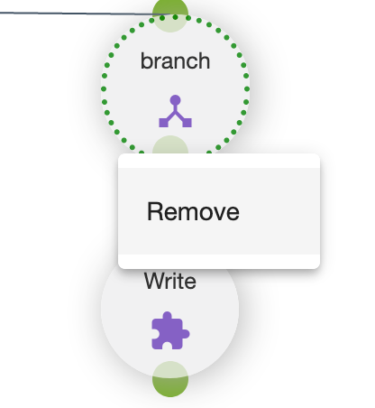
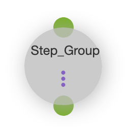
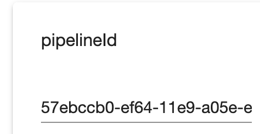

# Pipelines Editor
The pipelines editor allows a user to construct pipelines using the provided steps. The [Applications Editor](applications-editor.md) is the main consumer
of the pipelines.

# Actions
There are several actions that can be taken in the UI:

## Load
The load button will present a list of existing pipelines that can be loaded into the editor.
## New
Creates a new blank pipeline.
## Save
Saves the current pipeline.
## Cancel
Reverts any chages being made to the pipeline in the editor.
## Delete
Deletes the currently loaded pipeline.
## Copy
Creates a copy of the currently loaded pipeline. The user is still required to save the new pipeline.
## Export
Opens the code editor with the JSON for the currently loaded pipeline.
## Import
Opens the code editor and allows pasting pipeline JSON. The pipeline will be loaded into the editor and the user will be required to save.

# Pipeline Metadata
Each pipeline has several metadata fields that exist outside of the actual execution flow.

## Id
The unique id of this pipeline.
## Name
The name of the pipeline that will be displayed in other editors or logged by the Spark Pipeline Driver at runtime.
## Type
The pipeline type which will be either *Pipeline* for stand alone pipelines or *Step Group* for pipelines that may be embedded in other pipelines.

# Step Editor Form
When a step is selected in the designer, the metadata will be loaded into the step editor form. This form will be populated based o the metadata
provided by [Steps Editor](steps-editor.md). The form is broken into two parts: information and parameters.

## Information
This panel shows the static properties of the selected step.

### Step Id
This is the unique id for the step metadata.
### Name
The name of the selected step.
### Description
The detailed description of the selected step.
### Category
The category for the selected step.
### Engine Meta Command
This is the actual step function that will be called by the Spark Pipeline Driver.
### Engine Meta Package
This is the package for the executable code.
## Parameters
The parameters panel has all of the editable fields as well as the parameters for the step. Each of the parameters defined for the step will
be listed. An add button is provided that allows the user to specify more than one option for that parameter. The options are treated as an *or*
condition and executed in order.

### Id
This is the id of the step within the pipeline. This id will be logged at runtime while the pipeline is being executed.
### Execute If Empty
This field is only available when a step has been added to a Pipeline. Leaving this field empty will ensure that the step gets executed.

# Designer
A visual designer is provided to show the execution flow of the pipeline. The user may use the [Step Selector](step-selector.md) as a way to drag
and drop steps to the canvas. Connections are made by dragging from the output of a step to the input of the next step.

Each step has a context menu that can be accessed by holding the *shift* key and clicking the node.

## Step Groups
Step Groups represent embeddable pipelines within a pipeline. The step will appear slightly darker indicating that it is a step group:
 

and will have an additional context menu item to allow viewing the pipeline:
 

The preview will only be enabled when either the *pipelineId* field is set to an id known to the system or the *pipeline* property is of 
type **Pipeline** and resolves to a known pipeline.

Since the step group will run the pipeline within it's own context, the *pipelineMappings* field provides a way to pass data from the outer pipeline
to the embedded pipeline. When the editor is invoked, the inner pipeline (if known) will be scanned for any *globals* and presented as a form.
